<div align="center">

<!--  -->

<br>

<a href="mailto:quocviet15t12@gmail.com">
  
</a>
<a href="https://vietnguyen.io.vn">
  
</a>


</div>

---

## `root@nqv:~# whoami`

```text
Nguyen Quoc Viet
Telecommunications Engineering student at the Posts and Telecommunications Institute of Technology (PTIT), Ho Chi Minh City Campus.

I'm building a solid foundation in Linux systems, network infrastructure, and automation — working toward a long-term goal of becoming a DevOps Engineer.

My growth path:
Linux System Administration → Network Engineering → Automation → DevOps

I'm currently part of the student research project (NCKH) NetworkTools — a configuration management and automation tool for Cisco IOS devices, where I work on backend development, database design, and the desktop frontend.

I believe combining a strong telecommunications background with modern automation and systems-operations thinking is the path to becoming a well-rounded DevOps engineer.
```

## `root@nqv:~# cat stack.conf`

```ini
[core]
languages = C++, Python, Go
systems    = Linux Administration, Services, Permissions, Networking
networking = Cisco IOS, Routing, Switching, TCP/IP
platform   = Fedora Linux
tools      = Git, VS Code, EVE-NG, PostgreSQL, SQLite

[current_mission]
primary    = Linux Systems
secondary  = Network Engineering
cert_track = Cisco CCNA
status     = Building labs, troubleshooting, automating
```

<div align="center">

<!--  -->

</div>

